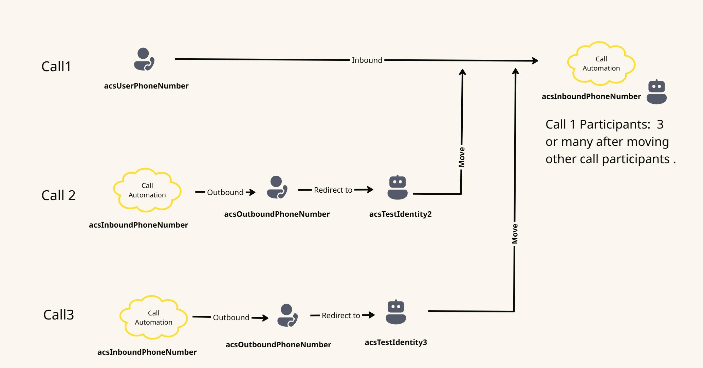

| page_type | languages                               | products                                                                    |
| --------- | --------------------------------------- | --------------------------------------------------------------------------- |
| sample    | <table><tr><td>Python</tr></td></table> | <table><tr><td>azure</td><td>azure-communication-services</td></tr></table> |

# Call Automation - Move Participants Sample

This sample demonstrates how to use the Call Automation SDK to implement a Move Participants Call scenario with Azure Communication Services.

---

## Table of Contents

- [Overview](#overview)
- [Design](#design)
- [Prerequisites](#prerequisites)
- [Getting Started](#getting-started)
- [Configuration](#configuration)
- [Running the App Locally](#running-the-app-locally)
- [Troubleshooting](#troubleshooting)

---

## Overview

This project provides a sample implementation for moving participants between calls using Azure Communication Services and the Call Automation SDK.

---

## Design



---

## Prerequisites

- **Azure Account:** An Azure account with an active subscription.  
  https://azure.microsoft.com/free/?WT.mc_id=A261C142F.
- **Communication Services Resource:** A deployed Communication Services resource.  
  https://docs.microsoft.com/azure/communication-services/quickstarts/create-communication-resource.
- **Phone Number:** A https://learn.microsoft.com/en-us/azure/communication-services/quickstarts/telephony/get-phone-number in your Azure Communication Services resource that can make outbound calls.
- **Azure Dev Tunnel:** https://learn.microsoft.com/en-us/azure/developer/dev-tunnels/get-started.

- [Python](https://www.python.org/downloads/) 3.7 or above.

---

## Getting Started

### Clone the Source Code

1. Open PowerShell, Windows Terminal, Command Prompt, or equivalent.
2. Navigate to your desired directory.
3. Clone the repository:
   ```sh
   git clone https://github.com/Azure-Samples/communication-services-python-quickstarts.git
   ```

### Set Up Python Virtual Environment and install Dependencies

```bash
cd communication-services-python-quickstarts/Python-MoveParticipantsSample
python -m venv venv
venv\Scripts\activate
pip install -r requirements.txt
```

## Setup and Host Azure Dev Tunnel

```
devtunnel create --allow-anonymous
devtunnel port create -p 8080
devtunnel host
```

---

## Configuration

Before running the application, initialize the following constants in the `main.py` file.

| Setting                     | Description                                                                                                                                          | Example Value                                                            |
| --------------------------- | ---------------------------------------------------------------------------------------------------------------------------------------------------- | ------------------------------------------------------------------------ |
| `ACS_CONNECTION_STRING`     | The connection string for your Azure Communication Services resource. Find this in the Azure Portal under your resource Keys section.            | `"endpoint=https://<RESOURCE>.communication.azure.com/;accesskey=<KEY>"` |
| `CALLBACK_URI_HOST`         | The base URL where your app will listen for incoming events from Azure Communication Services. For local development, use your Azure Dev Tunnel URL. | `"https://<your-dev-tunnel>.devtunnels.ms"`                              |
| `ACS_OUTBOUND_PHONE_NUMBER` | The Azure Communication Services phone number used to make outbound calls. Must be purchased and configured in your ACS resource.                    | `"+1XXXXXXXXXX"`                                                         |
| `ACS_INBOUND_PHONE_NUMBER`  | The Azure Communication Services phone number used to receive inbound calls. Must also be configured in your ACS resource.                           | `"+1XXXXXXXXXX"`                                                         |
| `ACS_USER_PHONE_NUMBER`     | The phone number of the external user to initiate the first call. Any valid phone number for testing.                                                | `"+1XXXXXXXXXX"`                                                         |
| `ACS_TEST_IDENTITY2`        | An Azure Communication Services user identity, generated using the ACS web client or SDK, used for testing participant movement.                     | `"8:acs:<GUID>"`                                                         |
| `ACS_TEST_IDENTITY3`        | Another ACS user identity, generated similarly, for additional test scenarios.                                                                       | `"8:acs:<GUID>"`                                                         |

### How to Obtain These Values

- **ACS_CONNECTION_STRING:**

  1. Go to the Azure Portal.
  2. Navigate to your Communication Services resource.
  3. Select "Keys & Connection String."
  4. Copy the "Connection String" value.

- **CALLBACK_URI_HOST:**

  1. Set up an Azure Dev Tunnel as described in the prerequisites.
  2. Use the public URL provided by the Dev Tunnel as your callback URI host.

- **ACS_OUTBOUND_PHONE_NUMBER / ACS_INBOUND_PHONE_NUMBER:**

  1. In your Communication Services resource, go to "Phone numbers."
  2. Purchase or use an existing phone number.
  3. Assign the number as needed for outbound/inbound use.

- **ACS_USER_PHONE_NUMBER:**  
  Use any valid phone number you have access to for testing outbound calls.

- **ACS_TEST_IDENTITY2 / ACS_TEST_IDENTITY3:**
  1. Use the ACS web client or SDK to generate user identities.
  2. Store the generated identity strings here.

#### Example `config variables`

```
  ACS_CONNECTION_STRING = "endpoint=https://<RESOURCE>.communication.azure.com/;accesskey=<KEY>",
  CALLBACK_URI_HOST = "https://<your-dev-tunnel>.devtunnels.ms",
  ACS_OUTBOUND_PHONE_NUMBER = "+1XXXXXXXXXX",
  ACS_INBOUND_PHONE_NUMBER = "+1XXXXXXXXXX",
  ACS_USER_PHONE_NUMBER = "+1XXXXXXXXXX",
  ACS_TEST_IDENTITY2 = "8:acs:<GUID>",
  ACS_TEST_IDENTITY3 = "8:acs:<GUID>"

```

---
## Running the App Locally

1. **Create an azure event grid subscription for incoming calls:**
   - Set up a Web hook(`https://<dev-tunnel-url>/api/MoveParticipantEvent`) for callback.
   - Add Filters:
     - Key: `data.From.PhoneNumber.Value`, operator: `string contains`, value: `acsUserPhoneNumber, Inbound Number (ACS)`
     - Key: `data.to.rawid`, operator: `string does not begin`, value: `8`
   - Deploy the event subscription.

2. **Run the Application:**
   - Navigate to the `MoveParticipantsSample` folder.
   - Run the application in debug mode.

3. **Workflow Execution**

> **Note:**  
> The phone numbers used here are taken from the Azure Communication Services resource.  
> The phone numbers are released and become available when the call is answered.
>
> **Call 2 and Call 3 must be answered after redirecting and before moving participants.**


##### Call 1

1. `USER_PHONE_NUMBER` calls `ACS_INBOUND_PHONE_NUMBER`.
2. When the call is created, note the Call Connection Id as **Target Call Connection Id**.
3. Call Automation answers the call and assigns a bot as the receiver.
4. `ACS_INBOUND_PHONE_NUMBER` is released from the call after it is answered and assigned to the bot.


##### Call 2

1. `ACS_INBOUND_PHONE_NUMBER` makes a call to `ACS_OUTBOUND_PHONE_NUMBER`.
2. When the call is created, note the Call Connection Id as **Source Call Connection Id**.
3. Call Automation answers the call, redirects to `ACS_TEST_IDENTITY_2`, and releases `ACS_OUTBOUND_PHONE_NUMBER` from the call.
4. The call connection id generated while redirection is an internal connection id; **do not use this connection id for the Move operation**.

##### Move Participant Operation

- **Inputs:**
  - Source Connection Id (from Call 2): the connection to move the participant from.
  - Target Connection Id (from Call 1): the connection to move the participant to.
  - Participant (initial participant before call is redirected) from Source call (Call 2): `ACS_OUTBOUND_PHONE_NUMBER`
- Participants list after `MoveParticipantSucceeded` event: 3


##### Call 3

1. `ACS_INBOUND_PHONE_NUMBER` makes a call to `ACS_OUTBOUND_PHONE_NUMBER`.
2. When the call is created, note the Call Connection Id as **Source Call Connection Id**.
3. Call Automation answers the call, redirects to `ACS_TEST_IDENTITY_3`, and releases `ACS_OUTBOUND_PHONE_NUMBER` from the call.
4. The call connection id generated while redirection is an internal connection id; **do not use this connection id for the Move operation**.

##### Move Participant Operation

- Inputs:
  - Source Connection Id (from Call 3): the connection to move the participant from.
  - Target Connection Id (from Call 1): the connection to move the participant to.
  - Participant (initial participant before call is redirected) from Source call (Call 3): `ACS_OUTBOUND_PHONE_NUMBER`
- Participants list after `MoveParticipantSucceeded` event: 4

---

## API Testing with Swagger

You can explore and test the available API endpoints using the built-in Swagger UI:

- **Swagger URL:**  
  [https://localhost:8080/docs](https://localhost:8080/docs)

> If running in a dev tunnel or cloud environment, replace `localhost:8080` with your tunnel's public URL (e.g., `https://<your-dev-tunnel>.devtunnels.ms/docs`).

---

## Troubleshooting

If you encounter issues while setting up or running the Call Automation sample, refer to the following troubleshooting tips:

### 1. Azure Communication Services Connection Issues

- **Error:** "Invalid connection string"  
  **Solution:** Double-check your `ACS_CONNECTION_STRING`. Ensure there are no extra spaces or missing characters. Obtain the connection string directly from the Azure Portal.

- **Error:** "Resource not found"  
  **Solution:** Verify that your Azure Communication Services resource exists and is in the correct subscription and region.

### 2. Dev Tunnel or Callback Issues

- **Error:** "Callback URL not reachable" or events not triggering  
  **Solution:**
  - Ensure your Azure Dev Tunnel is running and the URL in `CALLBACK_URI_HOST` matches the tunnel's public URL.
  - Confirm your firewall or network settings allow inbound connections to your local machine.
  - Make sure the application is running and listening on the correct port.

### 3. Phone Number Problems

- **Error:** "Phone number not provisioned" or "Invalid phone number"  
  **Solution:**
  - Confirm that the phone numbers in `ACS_OUTBOUND_PHONE_NUMBER` and `ACS_INBOUND_PHONE_NUMBER` are purchased and assigned in your Azure Communication Services resource.
  - Use format (e.g., `+1XXXXXXXXXX`).

### 4. Identity or Participant Issues

- **Error:** "Invalid ACS identity"  
  **Solution:**
  - Ensure `ACS_TEST_IDENTITY2` and `ACS_TEST_IDENTITY3` are valid ACS user identities generated via the ACS SDK or portal.
  - Regenerate identities if needed and update `main.py`.

### 5. General Debugging Tips

- Check application logs for detailed error messages.
- Ensure all configuration settings are correct.
- Restart your application and Dev Tunnel after making configuration changes.
- Review Azure Portal for resource status and quotas.

**Still having trouble?**

- Review the official https://learn.microsoft.com/azure/communication-services/.
- Search for similar issues or ask questions on https://learn.microsoft.com/answers/topics/azure-communication-services.html.
- Contact your Azure administrator or support team if you suspect a permissions or resource issue.
