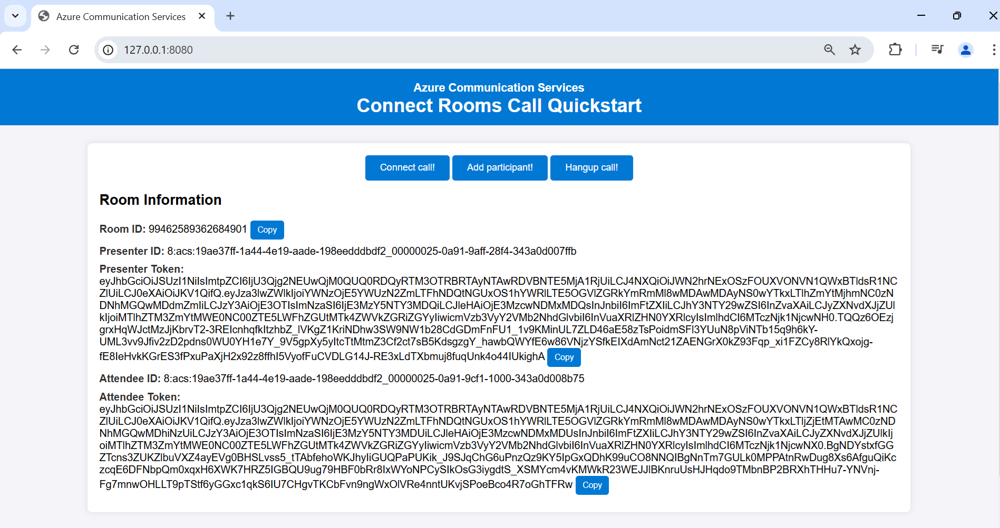
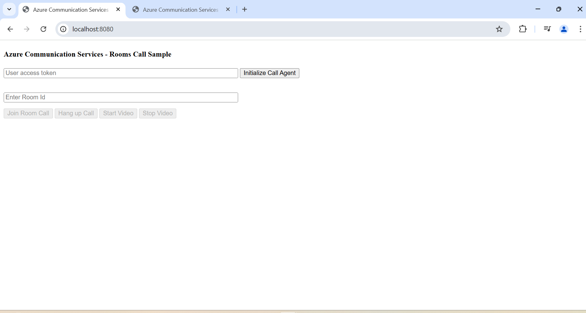
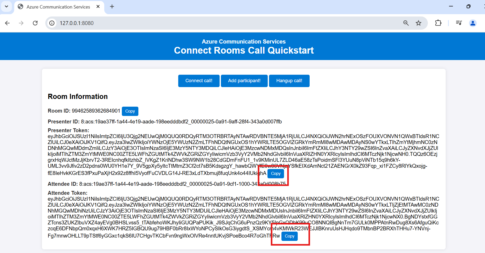
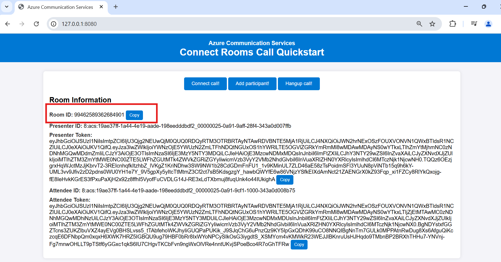
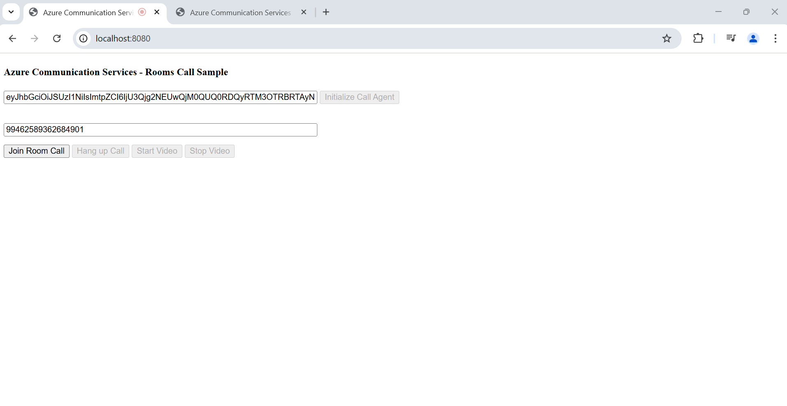
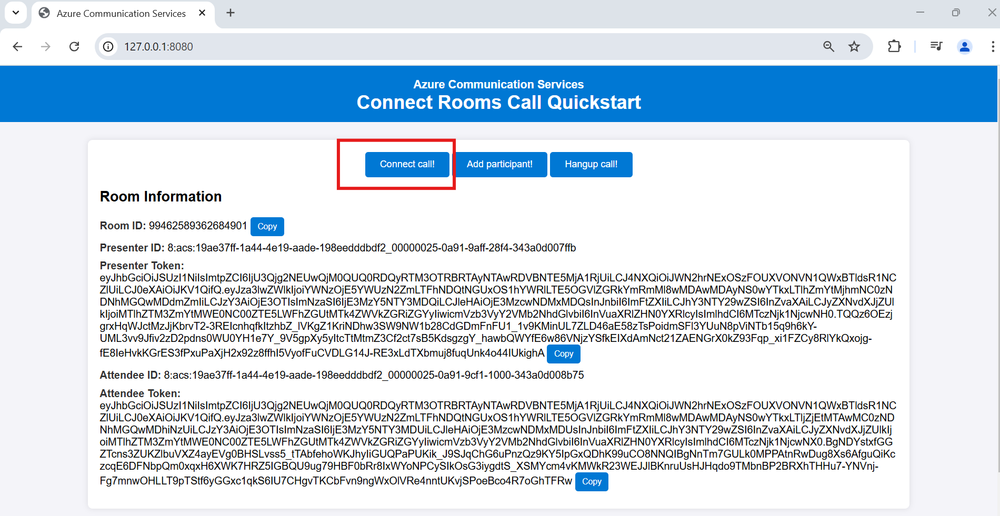

|page_type| languages                               |products
|---|-----------------------------------------|---|
|sample| <table><tr><td>Python</tr></td></table> |<table><tr><td>azure</td><td>azure-communication-services</td></tr></table>|

# Connect to a room call using Call Automation SDK

In this quickstart sample, we cover how you can use Call Automation SDK to connect to an active Azure Communication Services (ACS) Rooms call with a connect endpoint.
This involves creating a room call with room id and users and enabling PSTN dial out to add PSTN participant(s).

## Prerequisites

- Create an Azure account with an active subscription. For details, see [Create an account for free](https://azure.microsoft.com/free/)
- Create an Azure Communication Services resource. For details, see [Create an Azure Communication Resource](https://docs.microsoft.com/azure/communication-services/quickstarts/create-communication-resource). You'll need to record your resource **connection string** for this sample.
- An Calling-enabled telephone number. [Get a phone number](https://learn.microsoft.com/en-us/azure/communication-services/quickstarts/telephony/get-phone-number?tabs=windows&pivots=platform-azp).
- Create Azure AI Multi Service resource. For details, see [Create an Azure AI Multi service](https://learn.microsoft.com/en-us/azure/cognitive-services/cognitive-services-apis-create-account).
- [Python](https://www.python.org/downloads/) 3.7 or above.

## Before running the sample for the first time

1. Open an instance of PowerShell, Windows Terminal, Command Prompt or equivalent and navigate to the directory that you would like to clone the sample to.
2. git clone `https://github.com/Azure-Samples/communication-services-python-quickstarts.git`.
3. Navigate to `callautomation-connect-room` folder and open `main.py` file.

## Before running calling rooms quickstart
1. To initiate rooms call with room id https://github.com/Azure-Samples/communication-services-javascript-quickstarts/tree/main/calling-rooms-quickstart
2. cd into the `calling-rooms-quickstart` folder.
3. From the root of the above folder, and with node installed, run `npm install`
4. to run sample `npx webpack serve --config webpack.config.js`

### Setup the Python environment

[Optional] Create and activate python virtual environment and install required packages using following command 
```
python -m venv venv
venv\Scripts\activate
```
Install the required packages using the following command
```
pip install -r requirements.txt
```

### Setup and host your Azure DevTunnel

[Azure DevTunnels](https://learn.microsoft.com/en-us/azure/developer/dev-tunnels/overview) is an Azure service that enables you to share local web services hosted on the internet. Use the commands below to connect your local development environment to the public internet. This creates a tunnel with a persistent endpoint URL and which allows anonymous access. We will then use this endpoint to notify your application of calling events from the ACS Call Automation service.

```bash
devtunnel create --allow-anonymous
devtunnel port create -p 8080
devtunnel host
```

### Configuring application

Open `config.py` file to configure the following settings

1. - `CALLBACK_URI`: Ngrok url for the server port (in this example port 8080)
2. - `CONNECTION_STRING`: Azure Communication Service resource's connection string.
3. - `ACS_RESOURCE_PHONE_NUMBER`: Acs Phone Number
4. - `TARGET_PHONE_NUMBER`: Agent Phone Number to add into the call

## Run app locally

1. Navigate to `callautomation-connect-room` folder and run `main.py` in debug mode or use command `python ./main.py` to run it from PowerShell, Command Prompt or Unix Terminal
2. Browser should pop up with the below page. If not navigate it to `http://localhost:8080/` or your ngrok url which points to 8080 port.
3. To connect rooms call, click on the `Connect a call!` button or make a Http get request to https://<CALLBACK_URI>/connectCall

### Creating and connecting to room call.

1. Navigate to `http://localhost:8080/` or devtunnel url to create users and room id 
2. Open two tabs for Presenter and attendee   
3. Copy tokens for presenter and attendee from 
4. Initialize call agent with tokens for both presenter and attendee.
5. Take room id  and initiate rooms call for both users. 
6. Connect room call with callautomation connect call endpoint. 

