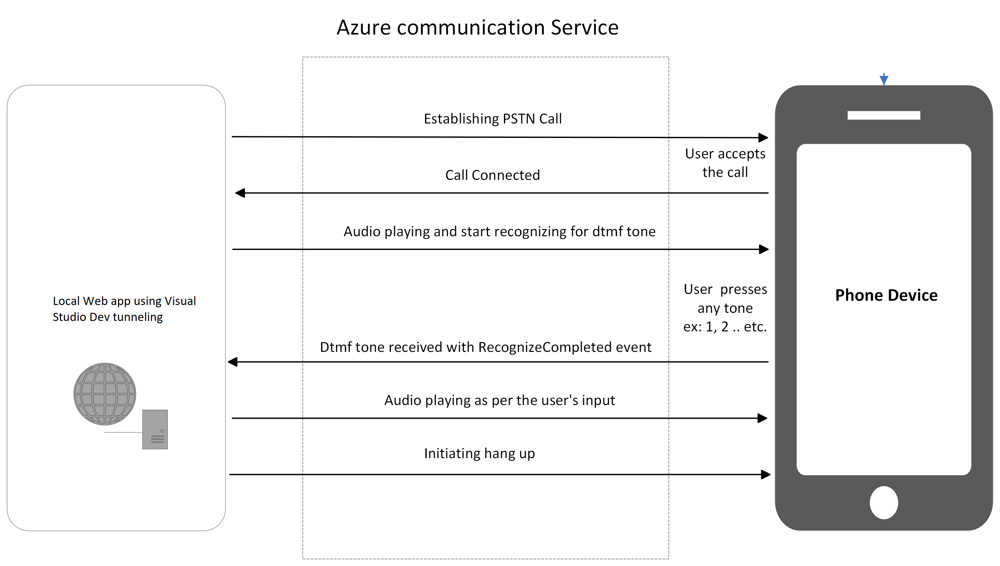

|page_type| languages                               |products
|---|-----------------------------------------|---|
|sample| <table><tr><td>Python</tr></td></table> |<table><tr><td>azure</td><td>azure-communication-services</td></tr></table>|

# Call Automation - Quick Start Sample

This sample application shows how the Azure Communication Services  - Call Automation SDK can be used to build IVR related solutions. 
It makes an outbound call to a phone number, performs DTMF recognition, plays a different audio message based on the key pressed by the callee and hangs-up the call. 
This sample application configured for accepting tone 1 (tone1), 2 (tone2) , If the callee pressed any other key than expected, the call will be disconnected.
This sample application is also capable of making multiple concurrent outbound calls. The application is a web-based application built on Python's Flask framework.

# Design



## Prerequisites

- An Azure account with an active subscription. [Create an account for free](https://azure.microsoft.com/free/?WT.mc_id=A261C142F). 
- A deployed Communication Services resource. [Create a Communication Services resource](https://docs.microsoft.com/azure/communication-services/quickstarts/create-communication-resource).
- A [phone number](https://learn.microsoft.com/en-us/azure/communication-services/quickstarts/telephony/get-phone-number) in your Azure Communication Services resource that can make outbound calls. NB: phone numbers are not available in free subscriptions.
- Create and host a Azure Dev Tunnel. Instructions [here](https://learn.microsoft.com/en-us/azure/developer/dev-tunnels/get-started)
- [Python](https://www.python.org/downloads/) 3.7+.

## Before running the sample for the first time

1. Open an instance of PowerShell, Windows Terminal, Command Prompt or equivalent and navigate to the directory that you would like to clone the sample to.
2. git clone `https://github.com/Azure-Samples/communication-services-python-quickstarts.git`.
3. Navigate to `callautomation-outboundcalling` folder and open `main.py` file.

### Setup the Python environment

Create virtual environment and install required packages using following command 
```
pip install -r requirements.txt
```

### Setup and host your Azure DevTunnel

[Azure DevTunnels](https://learn.microsoft.com/en-us/azure/developer/dev-tunnels/overview) is an Azure service that enables you to share local web services hosted on the internet. Use the commands below to connect your local development environment to the public internet. This creates a tunnel with a persistent endpoint URL and which allows anonymous access. We will then use this endpoint to notify your application of calling events from the ACS Call Automation service.

```bash
devtunnel create --allow-anonymous
devtunnel port create -p 8080
devtunnel host
```

### Configuring application

Open the main.py file to configure the following settings

1. `ACS_CONNECTION_STRING`: Azure Communication Service resource's connection string.
2. `ACS_PHONE_NUMBER`: Phone number associated with the Azure Communication Service resource. For e.g. "+1425XXXAAAA"
3. `TARGET_PHONE_NUMBER`: Target phone number to add in the call. For e.g. "+1425XXXAAAA"
4. `CALLBACK_URI_HOST`: Base url of the app. (For local development use dev tunnel url)

### Run app locally

1. Navigate to `callautomation-outboundcalling` folder and run `main.py` in debug mode or use command `python main.py` to run it from PowerShell, Command Prompt or Unix Terminal
2. Browser should pop up page with option to `Make outbound call`
3. To initiate the call, click on `Make outbound call` or make a Http get request to `https://<CALLBACK_URI_HOST>/api/outboundCall`